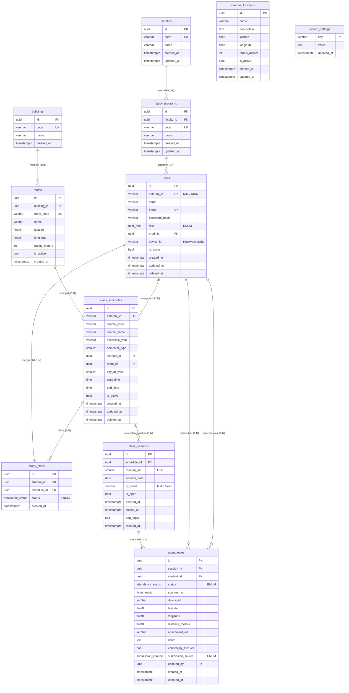
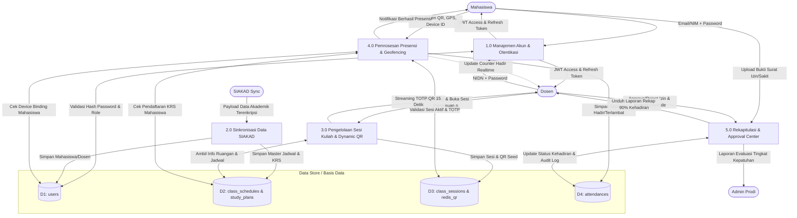

# DOKUMENTASI LENGKAP BASIS DATA (DATABASE SYSTEM SPECIFICATION)
## Sistem Presensi Kampus Geofencing & Dynamic Rolling QR Code (TOTP)
### Universitas Almuslim — Fakultas Ilmu Komputer

---

> **Mata Kuliah:** Basis Data / Sistem Basis Data  
> **Topik:** Perancangan & Implementasi Basis Data Relasional Transaksional Skala Perguruan Tinggi  
> **Target Pengujian:** Tugas Besar / Presentasi Akademik  
> **Teknologi DBMS:** PostgreSQL 15+ (Relasional Transaksional) & Redis (In-Memory Token Cache)  

---

## DAFTAR ISI

1. [Pendahuluan & Gambaran Umum Sistem](#1-pendahuluan--gambaran-umum-sistem)
2. [Aturan Bisnis Sistem (Business Rules)](#2-aturan-bisnis-sistem-business-rules)
3. [Daftar Entitas & Kamus Data (Data Dictionary)](#3-daftar-entitas--kamus-data-data-dictionary)
4. [Kardinalitas & Relasi Antar Tabel](#4-kardinalitas--relasi-antar-tabel)
5. [Struktur Primary Key, Foreign Key & Aksi Kaskade (Referential Integrity)](#5-struktur-primary-key-foreign-key--aksi-kaskade)
6. [Analisis Normalisasi Basis Data (1NF, 2NF, 3NF / BCNF)](#6-analisis-normalisasi-basis-data-1nf-2nf-3nf--bcnf)
7. [Entity Relationship Diagram (ERD)](#7-entity-relationship-diagram-erd)
   - 7.1 ERD Konseptual
   - 7.2 ERD Fisikal Lengkap (Mermaid Diagram)
8. [Data Flow Diagram (DFD)](#8-data-flow-diagram-dfd)
   - 8.1 DFD Level 0 (Diagram Konteks)
   - 8.2 DFD Level 1 (Dekomposisi Proses)
   - 8.3 Pemetaan Data Flow ke Data Store (Tabel Basis Data)
9. [Strategi Pengindeksan & Optimasi Kinerja (Indexing & Query Optimization)](#9-strategi-pengindeksan--optimasi-kinerja)
10. [Bahan & Ringkasan Slide Presentasi (Presentation Talking Points)](#10-bahan--ringkasan-slide-presentasi)

---

## 1. PENDAHULUAN & GAMBARAN UMUM SISTEM

Sistem Presensi Kampus Modern ini dirancang untuk mengatasi kelemahan mendasar pada presensi konvensional (tanda tangan kertas) maupun presensi digital statis (QR code tetap yang mudah difoto lalu disebarkan ke grup percakapan).

Basis data dirancang dengan arsitektur relasional menggunakan **PostgreSQL** yang menjamin prinsip **ACID (Atomicity, Consistency, Isolation, Durability)**, dipadukan dengan **Redis** untuk *in-memory caching* token QR bergulir (Time-based One-Time Password / TOTP).

### Keunggulan Desain Basis Data:
1. **Pencegahan Kecurangan (Anti-Fraud):** Validasi koordinat geografis (*Geofencing Haversine Formula*), pencatatan identitas perangkat keras (*Device Binding*), dan masa kedaluwarsa token QR dinamis (15 detik).
2. **Penanganan Beban Puncak (Concurrency Handling):** Ribuan mahasiswa melakukan pemindaian serentak pada menit-menit awal jam kuliah tanpa memicu *deadlock* atau *table locking*.
3. **Audit Trail & Dual-Channel Approval:** Mendukung pengajuan izin mandiri oleh mahasiswa (*self-request*) maupun input langsung oleh dosen (*manual override*) dengan pencatatan akun pengubah (`updated_by`).

---

## 2. ATURAN BISNIS SISTEM (BUSINESS RULES)

Aturan bisnis mendefinisikan batasan, integritas, dan alur operasional data dalam basis data:

### BR-01: Struktur Organisasi Akademik
- Setiap **Fakultas** (`faculties`) dapat membawahi satu atau banyak **Program Studi** (`study_programs`).
- Setiap **Program Studi** harus berada di bawah naungan tepat satu Fakultas.
- Penghapusan data Fakultas ditolak (*RESTRICT*) jika masih memiliki Program Studi aktif.

### BR-02: Manajemen Ruang & Geofence
- Setiap **Gedung** (`buildings`) memiliki satu atau banyak **Ruangan** (`rooms`).
- Setiap **Ruangan** memiliki koordinat lintang (`latitude`), bujur (`longitude`), dan radius toleransi (`radius_meters`, standar 35 meter).
- Kampus juga memiliki lokasi terpadu multikampus (`campus_locations`) dengan radius lebih luas (70–80 meter) sebagai acuan fallback validasi wilayah kampus.

### BR-03: Sivitas Akademika & Role-Based Access Control (RBAC)
- Setiap pengguna (`users`) diklasifikasikan ke dalam salah satu role: `mahasiswa`, `dosen`, `admin_prodi`, `pimpinan`, atau `superadmin`.
- Setiap pengguna memiliki identitas unik berupa `external_id` (NIM untuk Mahasiswa, NIDN/NIP untuk Dosen) dan `email`.
- Pengguna dengan role `mahasiswa` terikat pada satu perangkat aktif (`device_id`) saat pertama kali melakukan pemindaian untuk mencegah satu gawai dipakai bergantian untuk banyak akun (*titip absen*).

### BR-04: Penjadwalan Kuliah (Master Schedule) & KRS (Study Plan)
- Sebuah **Jadwal Kuliah** (`class_schedules`) menghubungkan Mata Kuliah, Dosen Pengampu (`lecturer_id`), Ruangan (`room_id`), Hari (`day_of_week`), serta Jam Mulai dan Jam Selesai.
- Mahasiswa mengambil jadwal melalui rencana studi (`study_plans`).
- Pasangan (`student_id`, `schedule_id`) bersifat unik (**Unique Constraint**) sehingga mahasiswa tidak dapat terdaftar ganda pada kelas yang sama.

### BR-05: Sesi Perkuliahan (Class Sessions)
- Dosen menginisiasi sesi kuliah pertemuan ke-`n` (`meeting_no` bernilai 1 hingga 16) untuk suatu jadwal.
- Pasangan (`schedule_id`, `meeting_no`) bersifat unik (**Unique Constraint**) sehingga satu nomor pertemuan tidak dapat dibuat dua kali pada jadwal yang sama.
- Sesi menyimpan `qr_seed` kriptografis yang digunakan bersama stempel waktu (*epoch timestamp*) untuk menghasilkan token dinamis yang berganti tiap 15 detik.

### BR-06: Transaksi Presensi (Attendances)
- Mahasiswa hanya dapat tercatat presensi jika:
  1. Terdaftar aktif pada kelas tersebut di tabel `study_plans`.
  2. Sesi kelas berstatus terbuka (`is_open = TRUE`).
  3. Token QR yang dikirimkan cocok dengan perhitungan TOTP server saat itu (atau jendela toleransi $\pm 1$ periode).
  4. Jarak mahasiswa ke koordinat ruangan atau koordinat kampus tidak melebihi radius batas (`distance_meters <= radius_meters`).
- Satu mahasiswa hanya memiliki tepat satu baris data per sesi kelas (**Unique Constraint:** `uq_session_student` pada `session_id` + `student_id`). Upaya presensi berulang ditolak secara atomik di level basis data.

### BR-07: Klasifikasi Status Kehadiran
- `hadir`: Scan mandiri tepat waktu (sebelum toleransi batas keterlambatan habis).
- `terlambat`: Scan mandiri setelah batas menit keterlambatan (misal $>15$ menit).
- `izin`: Ketidakhadiran berizin resmi yang disetujui dosen/admin dengan bukti surat (`attachment_url`).
- `sakit`: Ketidakhadiran karena sakit disertai bukti surat medis.
- `alpa`: Mahasiswa tidak hadir hingga sesi kuliah resmi ditutup oleh dosen.

### BR-08: Dual-Channel Submission & Audit Trail
- Kolom `submission_source` bertipe enum:
  - `self_scan`: Presensi otomatis hasil scan QR mandiri mahasiswa.
  - `app_request`: Pengajuan izin/sakit melalui aplikasi mahasiswa (menunggu persetujuan).
  - `manual_lecturer`: Dosen memasukkan atau mengubah status presensi secara manual.
- Kolom `updated_by` mencatat UUID dosen/admin yang melakukan modifikasi data historis untuk kebutuhan audit forensik akademik.

---

## 3. DAFTAR ENTITAS & KAMUS DATA (DATA DICTIONARY)

Berikut rincian seluruh tabel basis data PostgreSQL pada sistem:

### 3.1. Tabel `faculties` (Fakultas)
Menyimpan master data fakultas di lingkungan universitas.

| Nama Kolom | Tipe Data | Constraint | Keterangan |
| :--- | :--- | :--- | :--- |
| `id` | UUID | PRIMARY KEY, DEFAULT `gen_random_uuid()` | Pengidentifikasi unik fakultas |
| `code` | VARCHAR(20) | NOT NULL, UNIQUE | Kode singkatan fakultas (misal: `FIKOM`) |
| `name` | VARCHAR(150) | NOT NULL | Nama lengkap fakultas (misal: `Fakultas Ilmu Komputer`) |
| `created_at` | TIMESTAMPTZ | NOT NULL, DEFAULT `CURRENT_TIMESTAMP` | Waktu data dibuat |
| `updated_at` | TIMESTAMPTZ | NOT NULL, DEFAULT `CURRENT_TIMESTAMP` | Waktu data terakhir diperbarui |

---

### 3.2. Tabel `study_programs` (Program Studi)
Menyimpan program studi yang berada di bawah fakultas.

| Nama Kolom | Tipe Data | Constraint | Keterangan |
| :--- | :--- | :--- | :--- |
| `id` | UUID | PRIMARY KEY, DEFAULT `gen_random_uuid()` | Pengidentifikasi unik program studi |
| `faculty_id` | UUID | NOT NULL, FOREIGN KEY (`faculties.id`) ON DELETE RESTRICT | Relasi ke fakultas induk |
| `code` | VARCHAR(20) | NOT NULL, UNIQUE | Kode prodi (misal: `INF`, `TI`) |
| `name` | VARCHAR(150) | NOT NULL | Nama prodi (misal: `Informatika`) |
| `created_at` | TIMESTAMPTZ | NOT NULL, DEFAULT `CURRENT_TIMESTAMP` | Waktu pembuatan data |
| `updated_at` | TIMESTAMPTZ | NOT NULL, DEFAULT `CURRENT_TIMESTAMP` | Waktu pembaruan data |

---

### 3.3. Tabel `buildings` (Gedung Perkuliahan)
Menyimpan master gedung perkuliahan atau kompleks kampus.

| Nama Kolom | Tipe Data | Constraint | Keterangan |
| :--- | :--- | :--- | :--- |
| `id` | UUID | PRIMARY KEY, DEFAULT `gen_random_uuid()` | Pengidentifikasi unik gedung |
| `code` | VARCHAR(20) | NOT NULL, UNIQUE | Kode gedung (misal: `GD-A`, `LAB-TI`) |
| `name` | VARCHAR(150) | NOT NULL | Nama gedung (misal: `Gedung Kuliah Terpadu FIKOM`) |
| `created_at` | TIMESTAMPTZ | NOT NULL, DEFAULT `CURRENT_TIMESTAMP` | Waktu pencatatan gedung |

---

### 3.4. Tabel `rooms` (Ruangan & Geofence Titik Kelas)
Menyimpan data fisik ruang kelas beserta koordinat geolokasi untuk validasi geofence.

| Nama Kolom | Tipe Data | Constraint | Keterangan |
| :--- | :--- | :--- | :--- |
| `id` | UUID | PRIMARY KEY, DEFAULT `gen_random_uuid()` | Pengidentifikasi unik ruangan |
| `building_id` | UUID | NOT NULL, FOREIGN KEY (`buildings.id`) ON DELETE RESTRICT | Gedung lokasi ruangan |
| `room_code` | VARCHAR(30) | NOT NULL, UNIQUE | Nomor / kode ruangan (misal: `LAB-KOMP-2`) |
| `name` | VARCHAR(100) | NOT NULL | Nama ruangan (misal: `Lab Komputer Rekayasa Perangkat Lunak`) |
| `latitude` | DOUBLE PRECISION | NOT NULL | Titik lintang GPS ruangan (contoh: `5.193730`) |
| `longitude` | DOUBLE PRECISION | NOT NULL | Titik bujur GPS ruangan (contoh: `96.787492`) |
| `radius_meters`| INT | NOT NULL, DEFAULT `35` | Jarak batas toleransi presensi di ruangan ini (meter) |
| `is_active` | BOOLEAN | NOT NULL, DEFAULT `TRUE` | Status operasional ruangan |
| `created_at` | TIMESTAMPTZ | NOT NULL, DEFAULT `CURRENT_TIMESTAMP` | Waktu pembuatan data |

---

### 3.5. Tabel `users` (Pengguna / Sivitas Akademika)
Menyimpan seluruh identitas pengguna sistem: Mahasiswa, Dosen, Admin Prodi, Pimpinan, dan Superadmin.

| Nama Kolom | Tipe Data | Constraint | Keterangan |
| :--- | :--- | :--- | :--- |
| `id` | UUID | PRIMARY KEY, DEFAULT `gen_random_uuid()` | Pengidentifikasi unik pengguna |
| `external_id` | VARCHAR(50) | NOT NULL, UNIQUE | NIM (Mahasiswa) atau NIDN/NIP (Dosen/Admin) |
| `name` | VARCHAR(150) | NOT NULL | Nama lengkap beserta gelar akademik |
| `email` | VARCHAR(100) | NOT NULL, UNIQUE | Alamat email resmi kampus |
| `password_hash`| VARCHAR(255) | NOT NULL | Hash kata sandi terenkripsi (Bcrypt) |
| `role` | `user_role` (ENUM) | NOT NULL | Nilai: `mahasiswa`, `dosen`, `admin_prodi`, `pimpinan`, `superadmin` |
| `prodi_id` | UUID | NULLABLE, FOREIGN KEY (`study_programs.id`) ON DELETE SET NULL | Prodi asal pengguna (opsional untuk pimpinan/superadmin) |
| `device_id` | VARCHAR(120) | NULLABLE | UUID perangkat hardware HP (Device Binding anti titip absen) |
| `is_active` | BOOLEAN | NOT NULL, DEFAULT `TRUE` | Status aktif akun |
| `created_at` | TIMESTAMPTZ | NOT NULL, DEFAULT `CURRENT_TIMESTAMP` | Tanggal pendaftaran |
| `updated_at` | TIMESTAMPTZ | NOT NULL, DEFAULT `CURRENT_TIMESTAMP` | Waktu update profil |
| `deleted_at` | TIMESTAMPTZ | NULLABLE | Timestamp soft delete (NULL jika akun aktif) |

---

### 3.6. Tabel `class_schedules` (Jadwal Perkuliahan / Master Kelas)
Menyimpan jadwal definitif mata kuliah tiap semester.

| Nama Kolom | Tipe Data | Constraint | Keterangan |
| :--- | :--- | :--- | :--- |
| `id` | UUID | PRIMARY KEY, DEFAULT `gen_random_uuid()` | Pengidentifikasi unik jadwal kelas |
| `external_id` | VARCHAR(50) | NULLABLE, UNIQUE | Kode referensi jadwal dari SIAKAD kampus |
| `course_code` | VARCHAR(30) | NOT NULL | Kode mata kuliah (misal: `IF203`) |
| `course_name` | VARCHAR(150) | NOT NULL | Nama mata kuliah (misal: `Algoritma dan Pemrograman`) |
| `academic_year`| VARCHAR(10) | NOT NULL | Tahun ajaran (misal: `2026/2027`) |
| `semester_type`| SMALLINT | NOT NULL | Jenis semester: `1` (Ganjil), `2` (Genap), `3` (Pendek) |
| `lecturer_id` | UUID | NOT NULL, FOREIGN KEY (`users.id`) ON DELETE RESTRICT | Dosen pengampu utama |
| `room_id` | UUID | NOT NULL, FOREIGN KEY (`rooms.id`) ON DELETE RESTRICT | Ruangan tempat perkuliahan |
| `day_of_week` | SMALLINT | NOT NULL | Hari kuliah: `1` (Senin) s.d. `7` (Minggu) |
| `start_time` | TIME | NOT NULL | Waktu jam mulai kuliah (contoh: `08:00:00`) |
| `end_time` | TIME | NOT NULL | Waktu jam berakhir kuliah (contoh: `09:40:00`) |
| `is_active` | BOOLEAN | NOT NULL, DEFAULT `TRUE` | Status keaktifan kelas |
| `created_at` | TIMESTAMPTZ | NOT NULL, DEFAULT `CURRENT_TIMESTAMP` | Waktu pembuatan data |
| `updated_at` | TIMESTAMPTZ | NOT NULL, DEFAULT `CURRENT_TIMESTAMP` | Waktu modifikasi data |
| `deleted_at` | TIMESTAMPTZ | NULLABLE | Timestamp soft delete |

---

### 3.7. Tabel `study_plans` (KRS / Peserta Kuliah)
Menghubungkan mahasiswa dengan mata kuliah yang diambil pada semester berjalan (*Junction Table* antara `users` dan `class_schedules`).

| Nama Kolom | Tipe Data | Constraint | Keterangan |
| :--- | :--- | :--- | :--- |
| `id` | UUID | PRIMARY KEY, DEFAULT `gen_random_uuid()` | Pengidentifikasi unik pengambilan KRS |
| `student_id` | UUID | NOT NULL, FOREIGN KEY (`users.id`) ON DELETE CASCADE | Mahasiswa yang mengambil mata kuliah |
| `schedule_id` | UUID | NOT NULL, FOREIGN KEY (`class_schedules.id`) ON DELETE CASCADE | Kelas yang diikuti |
| `status` | `enrollment_status` (ENUM) | NOT NULL, DEFAULT `'active'` | Nilai: `active`, `dropped`, `withdrawn` |
| `created_at` | TIMESTAMPTZ | NOT NULL, DEFAULT `CURRENT_TIMESTAMP` | Tanggal entri KRS |

> **Unique Constraint:** `uq_student_schedule` (`student_id`, `schedule_id`) mencegah mahasiswa mengambil kelas yang sama lebih dari satu kali.

---

### 3.8. Tabel `class_sessions` (Sesi Pertemuan Kelas)
Mewakili satu kali tatap muka perkuliahan yang diinisiasi oleh dosen pengampu.

| Nama Kolom | Tipe Data | Constraint | Keterangan |
| :--- | :--- | :--- | :--- |
| `id` | UUID | PRIMARY KEY, DEFAULT `gen_random_uuid()` | Pengidentifikasi unik sesi |
| `schedule_id` | UUID | NOT NULL, FOREIGN KEY (`class_schedules.id`) ON DELETE RESTRICT | Jadwal kelas induk |
| `meeting_no` | SMALLINT | NOT NULL | Pertemuan ke- (1 hingga 16) |
| `session_date` | DATE | NOT NULL, DEFAULT `CURRENT_DATE` | Tanggal pelaksanaan perkuliahan |
| `qr_seed` | VARCHAR(64) | NOT NULL | Kunci acak (Seed) untuk generator TOTP Dynamic QR |
| `is_open` | BOOLEAN | NOT NULL, DEFAULT `TRUE` | Status sesi (`TRUE` = sedang dibuka dosen, `FALSE` = ditutup) |
| `opened_at` | TIMESTAMPTZ | NOT NULL, DEFAULT `CURRENT_TIMESTAMP` | Jam dan menit dosen membuka presensi |
| `closed_at` | TIMESTAMPTZ | NULLABLE | Jam dan menit dosen menutup presensi |
| `bap_topic` | TEXT | NULLABLE | Catatan Berita Acara Perkuliahan (BAP) |
| `created_at` | TIMESTAMPTZ | NOT NULL, DEFAULT `CURRENT_TIMESTAMP` | Waktu pembuatan data |

> **Unique Constraint:** `uq_schedule_meeting` (`schedule_id`, `meeting_no`) menjamin satu jadwal perkuliahan tidak memiliki nomor pertemuan ganda.

---

### 3.9. Tabel `attendances` (Data Transaksi Presensi)
Tabel transaksi utama (*Core Transaction Table*) yang menampung rekaman kehadiran mahasiswa per sesi pertemuan.

| Nama Kolom | Tipe Data | Constraint | Keterangan |
| :--- | :--- | :--- | :--- |
| `id` | UUID | PRIMARY KEY, DEFAULT `gen_random_uuid()` | Pengidentifikasi unik transaksi absensi |
| `session_id` | UUID | NOT NULL, FOREIGN KEY (`class_sessions.id`) ON DELETE CASCADE | Sesi kuliah yang dihadiri |
| `student_id` | UUID | NOT NULL, FOREIGN KEY (`users.id`) ON DELETE CASCADE | Mahasiswa yang melakukan presensi |
| `status` | `attendance_status` (ENUM) | NOT NULL | Nilai: `hadir`, `terlambat`, `izin`, `sakit`, `alpa` |
| `scanned_at` | TIMESTAMPTZ | NULLABLE | Waktu presensi terekam ke sistem |
| `device_id` | VARCHAR(120) | NULLABLE | ID perangkat saat memindai QR |
| `latitude` | DOUBLE PRECISION | NULLABLE | Posisi lintang koordinat mahasiswa saat scan |
| `longitude` | DOUBLE PRECISION | NULLABLE | Posisi bujur koordinat mahasiswa saat scan |
| `distance_meters` | DOUBLE PRECISION | NULLABLE | Jarak terhitung dari pusat geofence (meter) |
| `attachment_url` | VARCHAR(255) | NULLABLE | Path link berkas surat bukti jika izin/sakit |
| `notes` | TEXT | NULLABLE | Catatan tambahan |
| `verified_by_lecturer` | BOOLEAN | NOT NULL, DEFAULT `TRUE` | Status validasi dosen pengampu |
| `submission_source` | `submission_channel` (ENUM) | NOT NULL, DEFAULT `'self_scan'` | Nilai: `self_scan`, `app_request`, `manual_lecturer` |
| `updated_by` | UUID | NULLABLE, FOREIGN KEY (`users.id`) ON DELETE SET NULL | ID Dosen/Admin yang mengubah data (Audit Trail) |
| `created_at` | TIMESTAMPTZ | NOT NULL, DEFAULT `CURRENT_TIMESTAMP` | Waktu baris dibuat |
| `updated_at` | TIMESTAMPTZ | NOT NULL, DEFAULT `CURRENT_TIMESTAMP` | Waktu baris terakhir diubah |

> **Unique Constraint:** `uq_session_student` (`session_id`, `student_id`) menjamin seorang mahasiswa hanya bisa memiliki 1 baris kehadiran per sesi.

---

### 3.10. Tabel `campus_locations` (Lokasi Kampus / Fallback Multi-point)
Menyimpan area poligon/radius lingkungan kampus untuk validasi lokasi mahasiswa.

| Nama Kolom | Tipe Data | Constraint | Keterangan |
| :--- | :--- | :--- | :--- |
| `id` | UUID | PRIMARY KEY, DEFAULT `gen_random_uuid()` | Pengidentifikasi unik lokasi kampus |
| `name` | VARCHAR(150) | NOT NULL | Nama zona (misal: `Kampus Induk Umuslim Matang`) |
| `description` | TEXT | NULLABLE | Keterangan zona wilayah |
| `latitude` | DOUBLE PRECISION | NOT NULL | Titik lintang GPS pusat zona |
| `longitude` | DOUBLE PRECISION | NOT NULL | Titik bujur GPS pusat zona |
| `radius_meters`| INT | NOT NULL, DEFAULT `80` | Radius cakupan wilayah kampus (meter) |
| `is_active` | BOOLEAN | NOT NULL, DEFAULT `TRUE` | Status keaktifan titik lokasi |
| `created_at` | TIMESTAMPTZ | NOT NULL, DEFAULT `CURRENT_TIMESTAMP` | Waktu pembuatan |
| `updated_at` | TIMESTAMPTZ | NOT NULL, DEFAULT `CURRENT_TIMESTAMP` | Waktu modifikasi |

---

### 3.11. Tabel `system_settings` (Konfigurasi Global Sistem)
Menyimpan pengaturan pasangan *Key-Value* aplikasi secara dinamis.

| Nama Kolom | Tipe Data | Constraint | Keterangan |
| :--- | :--- | :--- | :--- |
| `key` | VARCHAR(50) | PRIMARY KEY | Kunci pengaturan (contoh: `max_tolerance_minutes`, `campus_sync_cron`) |
| `value` | TEXT | NOT NULL | Nilai konfigurasi |
| `updated_at` | TIMESTAMPTZ | NOT NULL, DEFAULT `CURRENT_TIMESTAMP` | Waktu perubahan pengaturan |

---

## 4. KARDINALITAS & RELASI ANTAR TABEL

Berikut pemetaan kardinalitas antar entitas dalam basis data:

| Entitas Sumber | Entitas Target | Kardinalitas | Penjelasan Relasi |
| :--- | :--- | :---: | :--- |
| `faculties` | `study_programs` | **1 : N** | Satu fakultas menaungi banyak program studi. Satu prodi wajib bernaung di bawah tepat 1 fakultas. |
| `study_programs` | `users` | **1 : N** | Satu prodi memiliki banyak pengguna (mahasiswa & dosen). Seorang pengguna terikat pada 1 prodi. |
| `buildings` | `rooms` | **1 : N** | Satu gedung memiliki banyak ruangan. Satu ruangan hanya berada di dalam tepat 1 gedung. |
| `rooms` | `class_schedules` | **1 : N** | Satu ruangan dapat dialokasikan untuk banyak jadwal perkuliahan pada jam dan hari yang berbeda. |
| `users` (Dosen) | `class_schedules` | **1 : N** | Seorang dosen dapat mengampu banyak jadwal perkuliahan dalam satu semester. |
| `users` (Mahasiswa) | `class_schedules` | **N : M** | Mahasiswa mengambil banyak jadwal kuliah, dan satu jadwal kuliah diikuti oleh banyak mahasiswa. Diimplementasikan via *Junction Table* `study_plans`. |
| `class_schedules` | `class_sessions` | **1 : N** | Satu jadwal perkuliahan menyelenggarakan 1 hingga 16 sesi tatap muka pertemuan kuliah. |
| `class_sessions` | `attendances` | **1 : N** | Satu sesi perkuliahan menampung banyak data presensi mahasiswa yang terdaftar di kelas tersebut. |
| `users` (Mahasiswa) | `attendances` | **1 : N** | Seorang mahasiswa memiliki banyak riwayat transaksi presensi selama masa studinya. |
| `users` (Auditor/Dosen) | `attendances` | **1 : N** | Seorang dosen/admin dapat memverifikasi atau mengoreksi banyak baris data absensi (`updated_by`). |

---

## 5. STRUKTUR PRIMARY KEY, FOREIGN KEY & AKSI KASKADE

Integritas referensial (*Referential Integrity*) dikontrol ketat melalui aturan `ON DELETE` pada setiap Foreign Key:

```
[faculties] ──(1:N, ON DELETE RESTRICT)──> [study_programs] ──(1:N, ON DELETE SET NULL)──> [users]
                                                                                               │
[buildings] ──(1:N, ON DELETE RESTRICT)──> [rooms] ────────(1:N, ON DELETE RESTRICT)───────────┤
                                                                                               ▼
                                                                                     [class_schedules]
                                                                                        │         │
                                        ┌───────────────────────────────────────────────┘         │
                                        │ (1:N, ON DELETE CASCADE)                                │ (1:N, ON DELETE RESTRICT)
                                        ▼                                                         ▼
                                 [study_plans]                                             [class_sessions]
                                  (KRS Siswa)                                                     │
                                        │                                                         │ (1:N, ON DELETE CASCADE)
                                        │                                                         ▼
                                        └──────────────────────────────────────────────────> [attendances]
```

### Rincian Aturan Aksi Integritas:
1. **`ON DELETE RESTRICT` (Mencegah Kehilangan Data Historis):**
   - Menghapus data fakultas yang masih memiliki prodi akan **ditolak**.
   - Menghapus data gedung atau ruangan yang masih dipakai jadwal aktif akan **ditolak**.
   - Menghapus data dosen pengampu pada jadwal perkuliahan akan **ditolak**.
   - Menghapus jadwal kuliah yang sudah memiliki rekaman sesi pertemuan akan **ditolak**.
2. **`ON DELETE CASCADE` (Pembersihan Data Terikat):**
   - Jika satu sesi pertemuan (`class_sessions`) dibatalkan atau dihapus oleh sistem, seluruh transaksi absensi (`attendances`) pada sesi tersebut otomatis terhapus bersih.
   - Jika suatu data entri KRS (`study_plans`) dihapus, keterikatan mahasiswa pada kelas tersebut langsung terlepas.
3. **`ON DELETE SET NULL` (Keamanan Audit Trail):**
   - Jika akun dosen/admin yang pernah mengedit suatu presensi (`updated_by`) dinonaktifkan/dihapus, nilai pada `attendances.updated_by` diset menjadi `NULL` tanpa menghapus data riwayat kehadiran mahasiswa.
   - Jika prodi dihapus, akun mahasiswa tetap ada (`users.prodi_id = NULL`).

---

## 6. ANALISIS NORMALISASI BASIS DATA

Desain basis data ini telah melewati proses normalisasi dari bentuk tidak normal (*Unnormalized Form*) hingga mencapai **Bentuk Normal Ketiga (3NF)** dan **Boyce-Codd Normal Form (BCNF)**:

### 6.1. Bentuk Normal Pertama (1NF)
- **Syarat:** Setiap kolom hanya berisi nilai tunggal (*Atomic Values*) dan tidak ada perulangan grup (*Repeating Groups*).
- **Penerapan:**
  - Jadwal kuliah tidak menyimpan daftar nama mahasiswa dalam format string/array pada satu kolom. Seluruh peserta dipisahkan ke tabel relasi `study_plans`.
  - Koordinat GPS dipecah menjadi nilai atomik numerik: `latitude` (lintang) dan `longitude` (bujur).
  - Waktu perkuliahan dipisahkan menjadi kolom atomik `start_time` dan `end_time`.

### 6.2. Bentuk Normal Kedua (2NF)
- **Syarat:** Sudah memenuhi 1NF, dan tidak ada ketergantungan fungsional parsial (*Partial Dependency*) pada Primary Key gabungan.
- **Penerapan:**
  - Seluruh tabel menggunakan *Surrogate Primary Key* berbasis **UUID** (`id`), sehingga seluruh atribut non-kunci bergantung penuh (*Fully Functionally Dependent*) pada Primary Key tabel tersebut.
  - Pada entitas relasi `study_plans`, atribut `status` dan `created_at` bergantung secara utuh pada relasi mahasiswa dan jadwal kelas (`student_id`, `schedule_id`).

### 6.3. Bentuk Normal Ketiga (3NF)
- **Syarat:** Sudah memenuhi 2NF, dan tidak ada ketergantungan transitif (*Transitive Dependency*) di mana atribut non-kunci bergantung pada atribut non-kunci lainnya.
- **Penerapan:**
  - Tabel `rooms` hanya menyimpan `building_id`, bukan menyalin nama atau kode gedung ke dalam tabel ruangan.
  - Tabel `class_schedules` tidak menyimpan nama dosen atau nama ruangan secara redundan, melainkan mereferensikan `lecturer_id` dan `room_id`. Jika nama dosen berubah di tabel `users`, data di jadwal otomatis konsisten.
  - Tabel `attendances` tidak menduplikasi data mata kuliah atau tanggal kuliah, melainkan mengaitkannya ke `session_id` yang terhubung ke `class_schedules`.

---

## 7. ENTITY RELATIONSHIP DIAGRAM (ERD)

### 7.1. ERD Konseptual
```
[FAKULTAS] ──<menaungi>──< [PROGRAM STUDI] ──<memiliki>──< [PENGGUNA / USERS]
                                                                 │
                                                       (sebagai Dosen)
                                                                 │
[GEDUNG] ──<memiliki>──< [RUANGAN] ──<ditempati>──< [JADWAL KULIAH]
                                                            │         │
                                      (diambil via KRS)     │         │ (memiliki)
                                             │              │         │
                                     [STUDY PLANS] <────────┘         ▼
                                             │                 [SESI KULIAH]
                                             │                        │
                                             │                 (dihadiri via QR)
                                             │                        │
                                             └────────────> [TRANSAKSI PRESENSI]
```

---

### 7.2. ERD Fisikal Lengkap (Mermaid Diagram)

Diagram berikut menampilkan struktur fisik lengkap tabel basis data, tipe data, Primary Key (PK), Foreign Key (FK), dan kardinalitasnya:



---

## 8. DATA FLOW DIAGRAM (DFD)

Data Flow Diagram menggambarkan perpindahan data antara entitas eksternal, proses komputasi, dan media penyimpanan (*data store*).

### 8.1. DFD Level 0 (Context Diagram)

Diagram Konteks menunjukkan batasan sistem secara makro dengan entitas luar:

```mermaid
flowchart TD
    MHS([Mahasiswa])
    DSN([Dosen])
    ADM([Admin Prodi / Pimpinan])
    SIAKAD([Sistem SIAKAD Kampus])

    SYS((Sistem Presensi Geofence & Dynamic QR))

    SIAKAD -->|Data Mahasiswa, Dosen, Jadwal Kuliah| SYS
    SYS -->|Status Sinkronisasi & Rekapitulasi| SIAKAD

    MHS -->|Kredensial Login| SYS
    MHS -->|Token QR, GPS Lintang/Bujur, Device ID| SYS
    MHS -->|Pengajuan Izin/Sakit + Bukti Surat| SYS
    SYS -->|Status Presensi (Hadir/Telat/Izin), KTM Digital, Notifikasi| MHS

    DSN -->|Kredensial Login| SYS
    DSN -->|Perintah Buka Sesi, Tutup Sesi, Topik BAP| SYS
    DSN -->|Verifikasi Izin / Koreksi Kehadiran| SYS
    SYS -->|Dynamic QR TOTP, Statistik Realtime, Rekap Kelas| DSN

    ADM -->|Pengaturan Geofence, Rekap Kepatuhan Dosen, Mahasiswa Kritis| SYS
    SYS -->|Executive Dashboard, Monitoring Kelas Live| ADM
```

---

### 8.2. DFD Level 1 (Dekomposisi Proses)

Dekomposisi proses terbagi menjadi 5 modul proses utama dengan 4 tabel data store:



---

### 8.3. Pemetaan Alur Data ke Tabel Basis Data

| Proses | Input Data | Operasi Database | Tabel yang Terlibat |
| :--- | :--- | :--- | :--- |
| **1.0 Login** | Email/NIM, Password | `SELECT` by email/NIM, verifikasi Bcrypt hash | `users` |
| **2.0 Sync SIAKAD** | JSON master kampus | `INSERT ... ON CONFLICT DO UPDATE` (Upsert) | `faculties`, `study_programs`, `users`, `class_schedules`, `study_plans` |
| **3.0 Buka Sesi** | `schedule_id`, `meeting_no` | `INSERT INTO class_sessions`, generate `qr_seed` | `class_sessions`, cache Redis |
| **4.0 Scan QR** | `session_id`, token, GPS, `device_id` | Hitung jarak Haversine, `INSERT INTO attendances` | `class_sessions`, `study_plans`, `users`, `attendances`, `rooms` |
| **5.0 Approval Izin** | `attendance_id`, status baru | `UPDATE attendances SET status = $1, updated_by = $2` | `attendances`, `users` |

---

## 9. STRATEGI PENGINDEKSAN & OPTIMASI KINERJA

Pada jam sibuk perkuliahan (pukul 08:00 WIB), sistem menerima ribuan *request* presensi dalam rentang 1–3 menit. Pengindeksan (*Indexing*) PostgreSQL dirancang secara presisi:

```sql
-- 1. Index Pencarian Sesi Kuliah yang Sedang Aktif (Partial Index)
-- Hanya mengindeks baris yang is_open = TRUE untuk memangkas ukuran index
CREATE INDEX idx_sessions_active_lookup
ON class_sessions (schedule_id)
WHERE is_open = TRUE;

-- 2. Index Anti-Duplikasi & Pengecekan Cepat Status Mahasiswa
-- Mempercepat verifikasi apakah mahasiswa sudah presensi di sesi ini
CREATE INDEX idx_attendances_session_student_lookup
ON attendances (session_id, student_id);

-- 3. Index Jadwal Kuliah Hari Ini
-- Digunakan saat beranda mahasiswa/dosen dimuat untuk menampilkan jadwal hari berjalan
CREATE INDEX idx_schedules_day_time
ON class_schedules (day_of_week, start_time, end_time)
WHERE is_active = TRUE AND deleted_at IS NULL;

-- 4. Index Monitoring Dashboard Realtime per Program Studi
CREATE INDEX idx_users_prodi_role 
ON users (prodi_id, role) 
WHERE is_active = TRUE;

-- 5. Index Audit Trail & Kanal Pengajuan Izin
CREATE INDEX idx_attendances_submission_source
ON attendances (submission_source);
```

### Mengapa Menggunakan Partial Index?
Daripada mengindeks seluruh jutaan baris data sesi perkuliahan historis, klausa `WHERE is_open = TRUE` membuat ukuran file index sangat kecil (hanya beberapa kilobyte) sehingga muat seluruhnya di RAM (*Buffer Cache*), memberikan waktu respons pencarian di bawah **1 milidetik**.

---

## 10. BAHAN & RINGKASAN SLIDE PRESENTASI

Gunakan panduan berikut sebagai naskah berbicara dan poin materi slide presentasi tugas mata kuliah Basis Data:

### Slide 1: Judul & Latar Belakang Masalah
- **Judul:** Perancangan Basis Data Terdistribusi Sistem Presensi Cerdas Berbasis Dynamic Rolling QR Code dan Geofencing.
- **Masalah:** Kelemahan presensi konvensional (titip absen, pemalsuan lokasi GPS, foto QR statis yang disebarkan).
- **Solusi Basis Data:** Skema transaksional relasional PostgreSQL yang mengunci duplikasi data secara atomik (*Unique Constraints*) dipadukan dengan validasi koordinat geografis presisi.

### Slide 2: Arsitektur Data & Alur Bisnis (Business Rules)
- **Multi-Role RBAC:** 5 role pengguna dengan relasi data terisolasi.
- **Jalur Kritis (Hot Path) Presensi:**
  1. Validasi KRS mahasiswa (`study_plans`).
  2. Validasi status sesi aktif (`class_sessions`).
  3. Validasi radius geofence ruangan ($\le 35\text{ m}$) dan kampus ($\le 80\text{ m}$).
  4. Penyimpanan atomik ke tabel `attendances`.

### Slide 3: Penjelasan ERD & Kardinalitas Utama
- Tunjukkan diagram **Mermaid ERD**.
- Jelaskan peran *Junction Table*:
  - `study_plans` memecah relasi N:M antara `users` (Mahasiswa) dan `class_schedules`.
  - `attendances` mencatat realisasi kehadiran mahasiswa pada setiap tatap muka `class_sessions`.
- Jelaskan penggunaan **UUID v4** sebagai Primary Key untuk mencegah *enumeration attack* dan memudahkan integrasi masa depan.

### Slide 4: Integritas Referensial & Anti-Duplikasi
- **Mekanisme Pencegahan Balapan (Race Condition):**
  - Mengandalkan `CONSTRAINT uq_session_student UNIQUE (session_id, student_id)`.
  - Jika mahasiswa menekan tombol scan berkali-kali atau menggunakan dua perangkat sekaligus, database otomatis menolak baris kedua dengan pesan *unique constraint violation*.
- **Kebijakan Kaskade:**
  - `ON DELETE RESTRICT` melindungi data master (Fakultas, Ruangan, Jadwal, Dosen).
  - `ON DELETE CASCADE` membersihkan riwayat turunan sesi.
  - `ON DELETE SET NULL` menjaga integritas jejak audit (*Audit Trail*).

### Slide 5: Normalisasi & Efisiensi Query (Indexing)
- Basis data telah memenuhi standar **3NF / BCNF** tanpa redundansi data yang tidak terkontrol.
- **Teknik Optimasi Index:** Penggunaan *Partial Index* (`WHERE is_open = TRUE` dan `WHERE is_active = TRUE`) untuk menjamin query pencarian tetap instan meski jumlah data mahasiswa mencapai puluhan ribu.

### Slide 6: Kesimpulan & Tanya Jawab
- Desain basis data ini terbukti tangguh (*robust*), terukur (*scalable*), aman (*tamper-proof*), dan siap digunakan untuk kebutuhan operasional perguruan tinggi.
