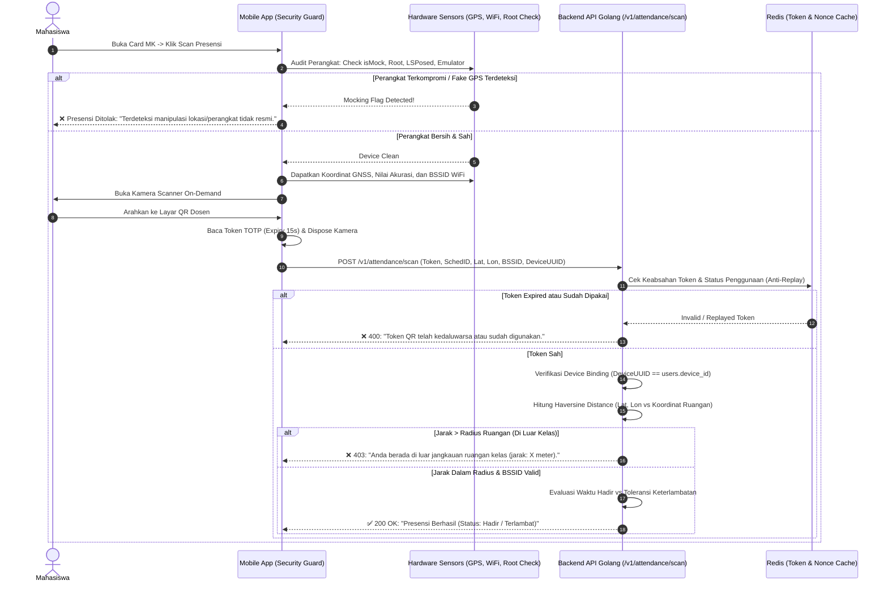

# Dokumentasi Spesifikasi Use Case Mobile App & Arsitektur Anti-Fake GPS (Zero-Trust Location)

Dokumen ini memuat spesifikasi fungsional *Use Case*, tata kelola alur kerja presensi berbasis *Course Card*, serta **Arsitektur Pertahanan Multi-Lapis Anti-Fake GPS (*Zero-Trust Geolocation*)** untuk sistem Presensi Online Universitas Almuslim.

---

## DAFTAR ISI
1. [Arsitektur Alur Akademik & Sinkronisasi Data](#1-arsitektur-alur-akademik--sinkronisasi-data)
2. [Spesifikasi Use Case Role Dosen](#2-spesifikasi-use-case-role-dosen)
3. [Spesifikasi Use Case Role Mahasiswa](#3-spesifikasi-use-case-role-mahasiswa)
4. [KTM Elektronik & Manajemen Sandi](#4-ktm-elektronik--manajemen-sandi)
5. [Arsitektur Pertahanan Multi-Lapis Anti-Fake GPS (Zero-Trust)](#5-arsitektur-pertahanan-multi-lapis-anti-fake-gps-zero-trust)
6. [Diagram Alur Keamanan Verifikasi Presensi](#6-diagram-alur-keamanan-verifikasi-presensi)
7. [Matriks Respon Keamanan & Sanksi Sistem](#7-matriks-respon-keamanan--sanksi-sistem)

---

## 1. Arsitektur Alur Akademik & Sinkronisasi Data

```
[ Pangkalan Data Utama Kampus (SIAKAD) ]
                   │
                   ▼ (Export JSON via Mock API Service)
[ AES-256-GCM Encrypted Feed ] ─── Auth Tag & Nonce Validation
                   │
                   ▼ (Golang Sync Worker Cron)
[ Normalisasi & Upsert Data ke Supabase PostgreSQL ]
  ├── faculties & study_programs
  ├── buildings & rooms (Geofence Coordinate & Radius)
  ├── users (Dosen, Mahasiswa, Admin - Default Password: "password")
  ├── class_schedules (Hari, Jam Mulai, Jam Selesai, Ruang, Dosen)
  └── study_plans (KRS Mahasiswa per Sesi Kelas)
                   │
                   ▼ (Golang Backend Engine: REST API & WebSocket)
  ┌─────────────────────────────────┴─────────────────────────────────┐
  ▼                                                                   ▼
[ Web Dashboard Admin & Dosen ]                         [ Flutter Mobile App ]
(https://dashboard.nexgenbot.my.id)                     (Dosen & Mahasiswa)
```

1. **Rencana Akademik & KRS:** Mahasiswa mengontrak matakuliah (KRS) di awal semester. Seluruh relasi mahasiswa dengan jadwal kelas (`study_plans`) tersinkronisasi otomatis ke database presensi.
2. **Satu Sumber Kebenaran (Single Source of Truth):** Web Dashboard dan Aplikasi Mobile terhubung ke Backend Golang yang sama (`api.nexgenbot.my.id`) dan membaca database yang sama di Supabase.

---

## 2. Spesifikasi Use Case Role Dosen

### 2.1 Tampilan Beranda (Home Screen)
- **Filter Jadwal Hari Ini:** Aplikasi secara otomatis memfilter jadwal berdasarkan hari berjalan (`todayDayOfWeek`). Jika hari ini Senin, hanya mata kuliah hari Senin yang muncul di halaman utama.
- **Card Mata Kuliah Terpadu:** Setiap mata kuliah disajikan dalam 1 Card informatif yang memuat:
  - Kode & Nama Mata Kuliah
  - Kelas / Unit (misal: Unit 01)
  - Ruangan & Gedung Perkuliahan
  - Jadwal Jam Mulai & Selesai
  - Status Sesi: *Belum Dibuka*, *Sedang Berlangsung*, atau *Selesai*.

### 2.2 Pembukaan Sesi Presensi (Hanya di Dalam Card MK)
- **Validasi Jadwal Ketat:** Dosen hanya dapat membuka sesi jika hari ini sesuai dengan jadwal perkuliahan (`schedule.day_of_week == todayDayOfWeek`).
- **Parameter Pembukaan Sesi:**
  - **Pertemuan Ke-N:** Otomatis mendeteksi pertemuan berikutnya (1 s/d 16). Sesuai aturan akademik, maksimal 1 pertemuan per mata kuliah per hari.
  - **Durasi Sesi:** Dosen menentukan berapa menit sesi dibuka (opsi: 15, 30, 45, 60 menit, atau custom).
  - **Toleransi Keterlambatan (*Late Tolerance*):** Dosen menentukan batas waktu toleransi hadir tepat waktu (misal: 15 menit). Mahasiswa yang scan sebelum batas waktu tercatat **Hadir**, setelahnya tercatat **Terlambat**.
- **Fitur Otomatisasi & Dynamic QR:**
  - Saat sesi dibuka, Dynamic QR Code (TOTP berputar tiap 15 detik) aktif dan dapat ditampilkan ke proyektor / layar ponsel dosen.
  - Hitung mundur (*countdown timer*) durasi sesi berjalan. Sesi dapat otomatis tertutup saat durasi habis, atau ditutup manual oleh dosen kapan saja.

### 2.3 Pemantauan Presensi Real-Time & Intervensi Manual
- Di dalam Card MK terdapat tab/daftar seluruh mahasiswa yang terdaftar di kelas tersebut (data KRS `study_plans`).
- Daftar mahasiswa memperlihatkan status langsung:
  - 🟩 **Hadir** (Scan mandiri tepat waktu)
  - 🟨 **Terlambat** (Scan mandiri melewati batas toleransi)
  - 🟦 **Izin / Sakit** (Diubah manual oleh dosen dengan alasan/catatan)
  - 🟥 **Belum Hadir** (Menunggu scan)
- **Tutup Sesi & Berita Acara Perkuliahan (BAP):**
  - Untuk menutup sesi, dosen wajib mengisi Ringkasan Materi / Topik Perkuliahan (BAP) minimal 10 karakter.
  - **Auto-Alpa Enforcement:** Saat sesi ditutup, sistem backend secara otomatis mengubah status seluruh mahasiswa yang belum hadir dan tidak memiliki status izin/sakit menjadi **Alpa (Tidak Hadir)** 🟥.

---

## 3. Spesifikasi Use Case Role Mahasiswa

### 3.1 Tampilan Beranda & Jadwal Kuliah
- Mahasiswa membuka aplikasi di hari berjalan (misal: Senin).
- Home screen hanya menampilkan Card mata kuliah yang jadwalnya jatuh pada hari tersebut.
- Setiap Card MK mahasiswa memuat:
  - Nama Mata Kuliah & Kode MK
  - Dosen Pengampu
  - Hari, Jam Kuliah, dan Ruangan
  - Status Sesi: Jika dosen belum membuka sesi, tombol presensi berstatus *"Menunggu Dosen Membuka Sesi"*.

### 3.2 Presensi Mandiri di Dalam Card MK
- **Tidak Ada Menu QR Mandiri di Luar Jadwal:** Tab scanner global yang menyala terus-menerus dihilangkan. Aksi presensi hanya dapat dilakukan dari dalam Card MK yang sesinya sedang aktif.
- **On-Demand Camera Activation:** Kamera ponsel **TIDAK AKTIF** saat membuka aplikasi atau menavigasi menu. Kamera **HANYA DIAKTIFKAN** saat mahasiswa menekan tombol *"Scan Presensi"* di Card MK yang aktif, dan seketika ditutup (*disposed*) begitu scan berhasil atau ditutup. Ini menghemat baterai dan beban memori perangkat secara drastis.

### 3.3 Visualisasi Matriks 16 Pertemuan
Di dalam setiap Card Mata Kuliah mahasiswa, ditampilkan indikator visual 16 pertemuan semester:
```
Status Kehadiran Semester (16 Pertemuan):
┌────┬────┬────┬────┬────┬────┬────┬────┬────┬────┬────┬────┬────┬────┬────┬────┐
│ 1  │ 2  │ 3  │ 4  │ 5  │ 6  │ 7  │ 8  │ 9  │ 10 │ 11 │ 12 │ 13 │ 14 │ 15 │ 16 │
├────┼────┼────┼────┼────┼────┼────┼────┼────┼────┼────┼────┼────┼────┼────┼────┤
│ 🟩 │ 🟩 │ 🟨 │ 🟦 │ 🟥 │ ⬜ │ ⬜ │ ⬜ │ ⬜ │ ⬜ │ ⬜ │ ⬜ │ ⬜ │ ⬜ │ ⬜ │ ⬜ │
└────┴────┴────┴────┴────┴────┴────┴────┴────┴────┴────┴────┴────┴────┴────┴────┘
```
**Arti Kode Warna:**
- 🟩 **Hijau (Hadir):** Mahasiswa hadir tepat waktu sesuai radius dan durasi.
- 🟨 **Kuning (Terlambat):** Mahasiswa hadir melewati batas toleransi keterlambatan.
- 🟦 **Biru (Sakit / Izin):** Mahasiswa dikonfirmasi izin atau sakit oleh dosen pengampu.
- 🟥 **Merah (Tidak Hadir / Alpa):** Sesi telah ditutup dan mahasiswa tidak melakukan presensi.
- ⬜ **Abu-abu (Belum Dimulai):** Pertemuan perkuliahan belum dilaksanakan / sesi belum dibuka.

---

## 4. KTM Elektronik & Manajemen Sandi

### 4.1 Kartu Tanda Mahasiswa (KTM) Digital
- Terintegrasi dengan endpoint `/v1/auth/me`.
- Menampilkan identitas resmi tanpa data kosong:
  - **Nama Lengkap Mahasiswa**
  - **NIM (Nomor Induk Mahasiswa)**
  - **Program Studi** (misal: S1 Informatika)
  - **Fakultas** (misal: Fakultas Ilmu Komputer)
  - **Status Akademik:** AKTIF (Tahun Akademik Berjalan)
  - **QR Verifikasi:** QR Code identitas digital untuk akses perpustakaan dan lab.

### 4.2 Fitur Keamanan & Ganti Sandi (Change Password)
- Dapat diakses melalui Tab **Profil -> Keamanan & Sandi** untuk Dosen maupun Mahasiswa.
- Form validasi:
  - Kata Sandi Lama
  - Kata Sandi Baru (minimal 6 karakter)
  - Konfirmasi Kata Sandi Baru
- Backend memverifikasi hash Bcrypt password lama dan mengupdate hash baru secara aman.

---

## 5. Arsitektur Pertahanan Multi-Lapis Anti-Fake GPS (Zero-Trust)

Untuk menjamin lokasi **100% TIDAK DAPAT DIBYPASS** menggunakan aplikasi Fake GPS, Mock Location Provider, Xposed/LSPosed Hooking, maupun Emulator PC, sistem menerapkan **Prinsip Pertahanan Berlapis (*Defense-in-Depth*)**.

```
              ┌────────────────────────────────────────────────────────┐
              │           PERMINTAAN SCAN PRESENSI MAHASISWA          │
              └───────────────────────────┬────────────────────────────┘
                                          │
    [ LAPIS 1: INTEGRITAS PERANGKAT ]     ▼
    ├── Deteksi Mock Location (isMockProvider = true) ─────────────► [ TOLAK 403: MOCK_LOCATION ]
    ├── Deteksi Root / Magisk / KernelSU / Zygisk ─────────────────► [ TOLAK 403: DEVICE_COMPROMISED ]
    ├── Deteksi Framework Hooking (LSPosed, Frida, Substrate) ─────► [ TOLAK 403: HOOK_DETECTED ]
    └── Deteksi Emulator (BlueStacks, Nox, Genymotion) ────────────► [ TOLAK 403: EMULATOR_FORBIDDEN ]
                                          │ (Lolos)
    [ LAPIS 2: SENSOR FUSION & NETWORK ]  ▼
    ├── Telemetri BSSID WiFi Kampus (MAC Router Fisik) ────────────► Cocokkan BSSID Gedung
    ├── Validasi Barometer / Akurasi GNSS (Accuracy < 25m) ────────► Tolak jika akurasi 0.0m atau >50m
    └── Cross-Check Cell Tower ID (CID / LAC) ─────────────────────► Validasi BTS area kampus
                                          │ (Lolos)
    [ LAPIS 3: KRIPTOGRAFI DYNAMIC TOTP ] ▼
    ├── Rolling QR Token (AES-256 Seed, Rotasi 15 Detik) ─────────► Tolak jika token kedaluwarsa
    ├── Single-Use Token Check (Anti Replay Attack via Redis) ──────► Tolak jika token sudah dipakai
    └── Device Binding (1 User ID = 1 Hardware UUID Terdaftar) ────► Tolak jika ganti ponsel
                                          │ (Lolos)
    [ LAPIS 4: KINEMATIK SERVER-SIDE ]    ▼
    ├── Algoritma Haversine Distance (Radius Ruang Kelas <= 40m) ──► Tolak jika di luar radius
    └── Analisis Kecepatan Lompatan (Teleportation Speed > 80km/h) ─► [ TOLAK 403: IMPOSSIBLE_TRAVEL ]
                                          │ (Semua Valid)
                                          ▼
                         [ STATUS PRESENSI: HADIR 🟩 ]
```

---

### Rincian 4 Lapisan Pertahanan:

### Lapis 1: Deteksi Integritas Perangkat & Sistem Operasi (Client-Side Kernel Check)
1. **Pemeriksaan Mock Location Asli Android & iOS:**
   - Android: Memeriksa flag `Location.isFromMockProvider()` dan `Location.isMock()` (Android 12/API 31+). Jika bernilai `true`, request langsung diblokir di level native.
   - Deteksi opsi pengembang (*Developer Options*): Memeriksa apakah opsi *Select Mock Location App* sedang menunjuk ke suatu package.
2. **Deteksi Aplikasi Spoofing Terinstal:**
   - Memindai daftar package terpasang untuk mendeteksi signature aplikasi Fake GPS populer (misal: `com.lexa.fakegps`, `com.incorporateapps.fakegps`, `com.fakelocation`, dll).
3. **Deteksi Root & Hooking Framework (Anti-Bypass via LSPosed/Frida):**
   - Aplikasi memeriksa keberadaan binary `su`, Magisk Manager, KernelSU, dan Zygisk.
   - Memeriksa integritas memory heap dari hooking library (`libfrida-gadget.so`, `libxposed_art.so`). Modul Fake GPS yang mencoba me-rehook fungsi `LocationManager.getLastKnownLocation` akan terdeteksi gagal integritas.
4. **Anti-Emulator Detection:**
   - Memeriksa properti build hardware (`ro.hardware`, `ro.kernel.qemu`, QEMU drivers). Presensi diharamkan dijalankan di emulator PC (BlueStacks, LDPlayer, Nox, Android Studio AVD). Hanya perangkat fisik resmi yang diizinkan.

### Lapis 2: Validasi Sensor Fusion & Jaringan Fisik (Radio Telemetry)
*Aplikasi Fake GPS hanya dapat memanipulasi koordinat latitude/longitude, namun **TIDAK BISA** memalsukan sinyal fisik radio pemancar sekitar perangkat:*
1. **BSSID / MAC Address WiFi Kampus (Kunci Emas):**
   - Ruang kelas dan laboratorium kampus dilengkapi access point WiFi (misal WiFi FIKOM / Lab Komputer).
   - Saat scan presensi, aplikasi mengirimkan BSSID (MAC Address) router WiFi yang tertangkap oleh antena ponsel mahasiswa.
   - Sekalipun mahasiswa memalsukan GPS seolah-olah berada di lab, ponselnya yang berada di rumah **tidak akan pernah bisa menangkap BSSID fisik router lab**. Jika BSSID tidak terdeteksi, presensi ditolak.
2. **Karakteristik Akurasi GNSS Fisik:**
   - GPS satelit asli selalu memiliki variansi akurasi alami (antara 3 s/d 18 meter di dalam gedung).
   - Aplikasi Fake GPS seringkali menginjeksi nilai akurasi statis yang tidak wajar (misal persis `0.0 meter` atau `1.0 meter` konstan). Nilai akurasi tanpa deviasi ini otomatis ditandai sebagai indikasi spoofing.

### Lapis 3: Kriptografi Dynamic Rolling QR (TOTP 15 Detik) + Device Binding
1. **Rotasi Token 15 Detik:**
   - Dosen menampilkan QR code yang dihasilkan dari algoritma TOTP (Time-based One-Time Password) dengan masa aktif hanya **15 detik**.
   - Setiap token hanya bisa digunakan satu kali per sesi (*One-Time Nonce* yang disimpan di Redis). Foto QR yang dikirimkan via WhatsApp atau screenshot akan kedaluwarsa sebelum sempat discan oleh mahasiswa yang tidak berada di kelas.
2. **Pengikatan Perangkat Keras (*Device Binding*):**
   - Setiap akun mahasiswa terikat secara kriptografis pada 1 UUID perangkat fisik (`users.device_id`).
   - Mahasiswa tidak dapat menitipkan akun ke ponsel temannya yang sedang berada di kelas, karena device ID yang berbeda akan otomatis ditolak dengan pesan error `"Perangkat tidak dikenal"`.

### Lapis 4: Validasi Kinematika & Geofencing Sisi Server (Server-Side Calculation)
1. **Haversine Geofence Calculation:**
   - Jarak dihitung di sisi backend Golang, bukan di sisi HP mahasiswa:
     $$d = 2r \arcsin \left( \sqrt{\sin^2\left(\frac{\Delta\phi}{2}\right) + \cos(\phi_1)\cos(\phi_2)\sin^2\left(\frac{\Delta\lambda}{2}\right)} \right)$$
   - Radius toleransi per ruangan diatur ketat (misal 35 meter untuk ruang teori, 40 meter untuk lab komputer).
2. **Deteksi Teleportasi / Anomali Kecepatan (*Velocity Check*):**
   - Jika seorang mahasiswa tercatat melakukan aktivitas login atau presensi di koordinat A, lalu 5 menit kemudian melakukan presensi di koordinat B dengan kecepatan perpindahan melebihi 80 km/jam, sistem server menandai transaksi sebagai *"Impossible Travel"* dan membatalkan presensi.

---

## 6. Diagram Alur Keamanan Verifikasi Presensi



---

## 7. Matriks Respon Keamanan & Sanksi Sistem

| Skenario Kecurangan | Metode Deteksi | Tindakan Sistem | Kode Respons |
| :--- | :--- | :--- | :--- |
| **Aplikasi Fake GPS Aktif** | `isFromMockProvider == true` / Mock Provider Setting | Blokir eksekusi scan seketika di level UI & kirim log anomali ke audit server. | `403 FORBIDDEN (MOCK_LOCATION_DETECTED)` |
| **Ponsel Di-Root / LSPosed Hook** | Deteksi binary `su`, Magisk zygote injection, atau Frida memory signature | Tolak aplikasi berjalan di perangkat atau kunci tombol presensi. | `403 FORBIDDEN (DEVICE_INTEGRITY_FAILED)` |
| **Menjalankan di Emulator PC** | Deteksi QEMU drivers, Build.FINGERPRINT generic, sensor null | Blokir total akses aplikasi mobile pada emulator. | `403 FORBIDDEN (EMULATOR_BLOCKED)` |
| **Titip Absen Foto QR (Kirim WA)** | Dynamic Rolling QR rotasi 15 detik + Single Use Nonce di Redis | Token kadaluwarsa saat teman di luar kelas mencoba men-scan foto kiriman. | `400 BAD REQUEST (TOKEN_EXPIRED)` |
| **Titip Akun / Login di HP Teman** | Kriptografi Device Binding (`device_id` hardware lock) | Akun ditolak login / scan di perangkat yang berbeda dari perangkat awal. | `403 FORBIDDEN (UNAUTHORIZED_DEVICE)` |
| **Manipulasi Jam / Time Drift** | Server-side Timestamp comparison (toleransi clock drift max 3 detik) | Tolak payload jika timestamp lokal perangkat berbeda drastis dari NTP server. | `400 BAD REQUEST (CLOCK_SKEW_DETECTED)` |

---
*Dokumen ini merupakan standar resmi implementasi keamanan presensi berbasis lokasi pada repositori dev-docs Smart Campus Presensi Online.*
